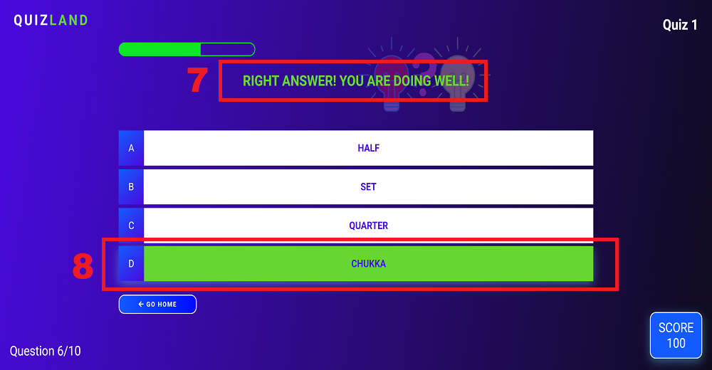

# Quiz Land - Game

# Introduction
Project milestone 2 for Code Institute Full-stack development program: JavaScript Essentials.

Quiz Land is a quiz game that allows players to test their knowledge in different topics. In Quiz Land there are 3 different quizzes available and it has 10 questions for each topic. If the user can answer the question correctly they will receive points. Quiz Land is a good way to have fun and also to learn while playing a game.

[Live Project Here](https://pedrocristo.github.io/portfolio_project_1/index.html)

## README Table Content

- [Quiz Land - Game](#quiz-land---game)
- [Introduction](#introduction)
  - [README Table Content](#readme-table-content)
  - [User Experience - UX](#user-experience---ux)
    - [User Stories](#user-stories)
  - [Design](#design)
    - [Wireframe](#wireframe)
    - [Website Structure](#website-structure)
      - [Pages:](#pages)
      - [Colour Scheme](#colour-scheme)
      - [Typography](#typography)
      - [Imagery](#imagery)
    - [Interactive Links](#interactive-links)
  - [Features](#features)
    - [Home Page](#home-page)
    - [Navigation Menu](#navigation-menu)
      - [Side Navigation Menu Desktop](#side-navigation-menu-desktop)
      - [Side Navigation Menu Tablet](#side-navigation-menu-tablet)
      - [Navigation Menu Mobile](#navigation-menu-mobile)
      - [Navigation Menu Day/Night Mode](#navigation-menu-daynight-mode)
    - [Quiz Game 1 - Sports](#quiz-game-1---sports)
    - [Quiz Game 2 - History](#quiz-game-2---history)
    - [Quiz Game 3 - Geography](#quiz-game-3---geography)
    - [Game End Page](#game-end-page)
    - [Trophy Gold Page](#trophy-gold-page)
    - [Trophy Silver Page](#trophy-silver-page)
    - [Trophy Bronze Page](#trophy-bronze-page)
    - [High Scores Page](#high-scores-page)
  - [Future Features](#future-features)
    - [Progress Bar Right/Wrong Answers](#progress-bar-rightwrong-answers)
  - [How To Play](#how-to-play)
      - [Right Answer](#right-answer)
      - [Wrong Answer](#wrong-answer)
  
* [Features](#features)  
    * [Home Page](#home-page) 
    * [Navigation Menu](#navigation-menu)
    * [Quiz Game 1 - Sports](#quiz-game-1---sports)
    * [Quiz Game 2 - History](#quiz-game-2---history)
    * [Quiz Game 3 - Geography](#quiz-game-3---geography)
    * [Game End Page](#game-end-page) 
    * [Trophy Gold Page](#trophy-gold-page)
    * [Trophy Silver Page](#trophy-silver-page)
    * [Trophy Bronze Page](#trophy-bronze-page)
    * [High Scores Page](#hign-scores-page)
* [Future Features](#future-features)
* [How to Play](#how-to-play)
* [Technologies Used](#technologies-used)
    * [Languages Used](#languages-used)
    * [Frameworks - Libraries - Programs Used](#frameworks---libraries---programs-used)
* [Testing](#testing)
* [Deployment](#deployment-this-project)
    * [Deployment This Project](#deployment-this-project)
    * [Forking This Project](#forking-this-project)
    * [Cloning This Project](#cloning-this-project)
* [Credits](#credits)
* [Content](#content)

## User Experience - UX

 ### User Stories

* As a website creator, I want to:
  
1. Build an online quiz that is visually appealing from the user’s first visit so they are intrigued to explore and play the game.
2. Build an easy to navigate quiz and game for its users to play.
3. Build a quiz that is both enjoyable and challenging for the user. 
   
* As a new visitor, I want to:

1. Be able to understand the main purpose of the game.
2. Be able to easily navigate throughout the game and choose a quiz to play.
3. Be able to see my results after playing the game.
   
* As a returning visitor, I want to:

1. Be able to find new quizzes when they are available.
2. Be able to check the Height Scores page
3. Be able to challenge myself and improve on my scores.
   
## Design

### Wireframe
In this project I decided to build a prototype using the tool Canva before starting work on the code. It was helpful from an UX perspective as I could display the different elements in the screen and work with them with the objective of building an application that would be easily used by the users. 
[Live Project Wireframe Here](https://cutt.ly/oIkZsAW)

### Website Structure
The Quiz Land is a nine page website that has been designed to look like an application in small devices.
#### Pages:
* Homepage
* Quiz 1 - Sports
* Quiz 2 - History
* Quiz 3 - Geography
* Game End 
* Trophy Gold 
* Trophy Silver
* Trophy Bronze
* High Scores  

#### Colour Scheme
  
 The main colour scheme I chose for this project is an overall blue tone and purple with a darker colour for maximum user accessibility. I have choosen a green color as an interactive-color to contrast with the background.

 #### Typography
* The Roboto, sans-serif is used as the main font for the whole website.
      
#### Imagery
* 3 images were used as a background for the website pages.
* 1 image was used for the Favicon.
  
### Interactive Links  
* At the bottom of the Home page, users can access the game's social media links (Facebook and Instagram). Once these icons are clicked they open a new tab. 
  
## Features

### Home Page 

* When the users reach the website, they are instantly greeted on the Homepage and they have access to the button to start playing immmediately. Also there is a sidebar opening by pressing the hamburger icon on the top right, here users can start to play but they can also choose a different quiz or just check the High Scores board. On the bottom right side the players can access the game's official social media pages. 
[Live Page Here](https://pedrocristo.github.io/portfolio_project_2/index.html)

### Navigation Menu

#### Side Navigation Menu Desktop

* At the top right of the website, users can find a hamburger menu that is fully responsive in all devices. In this navigation menu users can navigate to the different quizzes and also check the High Scores board. 
* 
  #### Side Navigation Menu Tablet
 

  #### Navigation Menu Mobile

  #### Navigation Menu Day/Night Mode

  * Menu Day/Night Mode. From 8am to 8pm users can access the navigation menu when open in day mode (background-color white), from 8pm to 8am users can access the same menu in night mode (background-color black).

### Quiz Game 1 - Sports

* All of the game happens in this feature. Here the users will see the questions and they have 4 choices as their answer. The player will choose one and will see if the answer given is right or wrong. 
The topic questions in Quiz 1 are Sports.  
[Live Page Here](https://pedrocristo.github.io/portfolio_project_2/pages/game-1.html)

### Quiz Game 2 - History

* This feature has the same purpose as Quiz 1 but here the topic questions are History.  
[Live Page Here](https://pedrocristo.github.io/portfolio_project_2/pages/game-2.html)

### Quiz Game 3 - Geography

* This feature has the same purpose as Quiz 1 and Quiz 2 but here the topic questions are Georaphy.  
[Live Page Here](https://pedrocristo.github.io/portfolio_project_2/pages/game-3.html)

### Game End Page

* Game End feature is the page that users go after a quiz is finished. Here the players can see the last score and save their usernames. 
[Live Feature Here](https://pedrocristo.github.io/portfolio_project_2/pages/game-end.html)

### Trophy Gold Page

* After the user saves the game and if they score 250 they are brought to this feature to receive the gold medal. 
[Live Feature Here](https://pedrocristo.github.io/portfolio_project_2/pages/trophy-gold.html)

### Trophy Silver Page

* After the user saves the game and if they score 225 they are brought to this feature to receive the silver medal. 
[Live Feature Here](https://pedrocristo.github.io/portfolio_project_2/pages/trophy-silver.html)

### Trophy Bronze Page

* After the user saves the game and if they score 200 they are brought to this feature to receive the bronze medal. 
[Live Feature Here](https://pedrocristo.github.io/portfolio_project_2/pages/trophy-bronze.html)

### High Scores Page

* In the High Scores feature users can check the best scores by the individual players. 
[Live Feature Here](https://pedrocristo.github.io/portfolio_project_2/pages/scores.html)

## Future Features
  
### Progress Bar Right/Wrong Answers

* I am planning to add a feature with two progress bars.  One progress bar to show the number of right answers and the other to show the number of wrong answers in the last game played.

## How To Play

* The player has 3 different quizzes in the game. For each quiz the user will see the question on the top center [2] and 4 choices [3] are available.
The player then has to choose one of the choices and if the answer is right will win 25 points. The score will be displayed on the bottom right[5]. 
While the game is going on, users can see the progress bar updating any time they answer a question [1] and the question counter will also update on the bottom left [4] .
On the top right the users can check at any time what quiz they are on [6].

#### Right Answer

* When the user answers the question right the message "Right Answer" will appear on the top center [7] and the background color of their choice answer will turn green [8].

#### Wrong Answer

* When the user answers the question wrong the message "Wrong Answer" will appear on the top center [9] and the background color of their choice answer will turn red [10].

